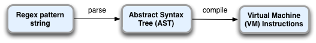

!SLIDE code small bullet incremental
# REGEX PERFORMANCE /UNDER THE HOOD #

!SLIDE code small bullet incremental
# REGEX PERFORMANCE #

* You should not write regexex you dont fully understand  

* Regexes are fast, efficient.

!SLIDE code small bullet incremental
# UNDER THE HOOD #

* Uses a regular expression engine **Oniguruma**  

* 

* First step oniguruma reads the regex search pattern, 
  tokenizes it.

* Makes a tree structure containing series of syntax nodes.

* Oniguruma compiles it into a series of instructions which
  later get executed by a virtual machine.

!SLIDE code small bullet incremental
# HACKING TIME #

## clone this github.com/ashish173/joshtalk.git ##
## Babynames Problem ##

!SLIDE code small bullet incremental
# THANKS YOU #
## QUESTIONS ##
